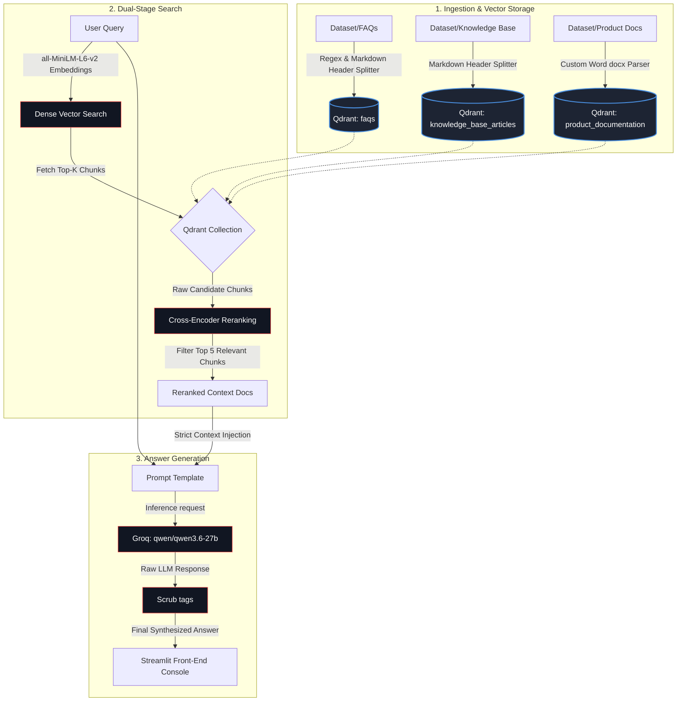

# ✨ RAG Playground Pro

A high-performance, modular **Retrieval-Augmented Generation (RAG)** pipeline and analytics playground. This application enables real-time testing, comparison, and analysis of advanced document parsing, vector search, neural reranking, and LLM synthesis under a single glassmorphic Streamlit interface.

---

## System Architecture & Workflow

The pipeline utilizes a multi-stage retrieval architecture designed for high precision and minimal distraction.



---

## Key Features

### 1. Multi-Format High-Fidelity Document Ingestion
*   **FAQ Segmenter:** A custom chunker that combines `MarkdownHeaderTextSplitter` with regex markers (`**Q:`) to isolate distinct Q&A pairs.
*   **Robust DOCX Parser:** A custom Word document loader that processes layouts sequentially, transforms single-column tables into bash code-blocks, formats multi-column tables into readable Markdown rows, detects hierarchy using font sizes, and appends document-level metadata to chunk properties.
*   **Vector Database Storage:** Vector embedding generations loaded cleanly into separate [Qdrant](https://qdrant.tech/) collections (`faqs`, `knowledge_base_articles`, `product_documentation`).

### 2. Dual-Stage Neural Search Pipeline
*   **First-Stage Retrieval:** Dense vector retrieval using the `sentence-transformers/all-MiniLM-L6-v2` embedding model.
*   **Second-Stage Reranking:** Neural cross-encoder reranking powered by `cross-encoder/ms-marco-MiniLM-L-6-v2`. This ensures that semantic overlap is measured directly, reducing context noise and selecting the top 5 most relevant documents for the context window.


### 3. Interactive RAG Console UI
An elegant interface featuring real-time latency telemetry, adjustable retrieval parameters, and a side-by-side comparison panel for raw vector matches vs. cross-encoder reranked documents.

<p align="center">
  
</p>
<p align="center">
  
</p>
<p align="center">
  
</p>

---

## Project Directory Structure

```text
├── Dataset/                              # Raw source documentation
│   ├── FAQs/                             # Markdown FAQs (GitHub, OpenAI, Stripe)
│   ├── Knowledge Base Articles/          # Markdown KB articles (Atlassian, Notion)
│   └── Product Documentaion/             # Word files (.docx) (Docker, K8s, Python, React)
├── app.py                                # Main Streamlit frontend dashboard
├── retrieval.py                          # Vector similarity search orchestration
├── reranker.py                           # Cross-encoder neural reranker definition
├── generation.py                         # Groq LLM client & prompting template
├── ingestion.ipynb                       # Data chunking & vector database seeding
├── requirements.txt                      # Project library dependencies
└── .env                                  # Local configuration (keys, API endpoints)
```

---

## Installation & Setup

### Prerequisites
*   Python 3.10+
*   A running instance of **Qdrant** (local container or Qdrant Cloud Cluster)
*   A **Groq API Key**

### 1. Clone & Initialize Environment
```bash
# Clone the repository
git clone https://github.com/yourusername/rag-playground-pro.git
cd rag-playground-pro

# Create and activate a virtual environment
python -m venv venv
# On Windows:
venv\Scripts\activate
# On Linux/macOS:
source venv/bin/activate

# Install dependencies
pip install -r requirements.txt
```

### 2. Configure Environment Variables
Create a `.env` file in the root directory:
```env
QDRANT_URL="https://your-qdrant-instance.aws.cloud.qdrant.io"
QDRANT_API_KEY="your-qdrant-api-key"
GROQ_API_KEY="gsk_your_groq_api_key"
```

### 3. Ingest Documents into Qdrant
Open the Jupyter notebook `ingestion.ipynb` and run all cells to extract, chunk, and embed your raw documents from the `Dataset/` folder, importing them directly into Qdrant collections.

```bash
jupyter notebook ingestion.ipynb
```

### 4. Launch the Streamlit Web Application
Execute the Streamlit application to start the interactive playground console:

```bash
streamlit run app.py
```

Once running, navigate to `http://localhost:8501` to use the dashboard!

---

## Code Modules Walkthrough

*   **`app.py`**: Manages frontend interactive state variables, controls parameters like retrieval `top_k`, and displays metrics cards alongside raw source comparison modules.
*   **`retrieval.py`**: Interacts with the `QdrantVectorStore` from LangChain, fetches raw similarities, and invokes the reranking interface.
*   **`reranker.py`**: Instantiates a cross-encoder model cached locally and scores candidate documents against the question text.
*   **`generation.py`**: Connects with Groq's high-throughput API, formats constraints, and filters formatting anomalies (like `<think>` tags).
